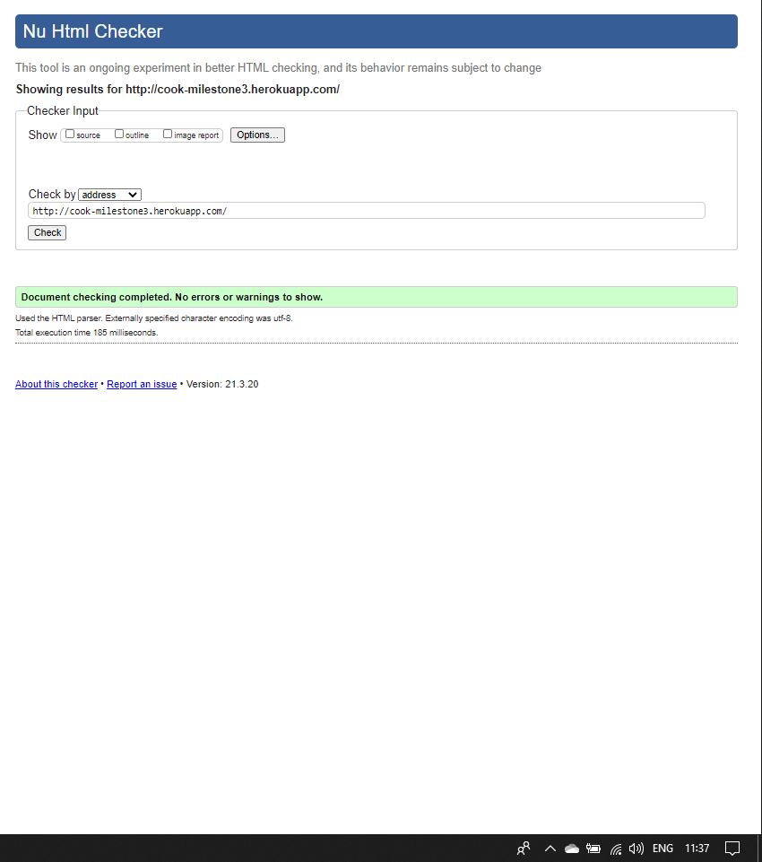
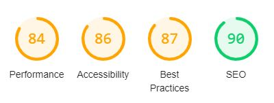

# C O O K

For this project, I have used HTML, CSS, Python(using Flask framework). The small amount of JavaScript has been handled by Bootstrap using a Jquery CDN. I have created the site to demonstrate CRUD capabilities of a MongoDB.

[Link to my deployed site on Heroku](https://cook-milestone3.herokuapp.com/)

---

# User Experience (UX)

The purpose of my site is almost like that of a personal recipe book. The user can create an account or log in(if they already have an account) and can add recipes which will be visible on the recipes page and their profile page. Users can view all recipes added to the database by other users or themselves. Users can edit or delete their own recipes but cannot make any changes to other's recipes.

## User Stories

## First Time Visitor Goals

- I want to understand the purpose of the site within a short time of visiting the site by the images and description on the landing page
- I want to easily create an account to make full use of the site
- I want to add, edit and delete my own recipes
- I want to view recipes submitted by other users
- I want to search the recipe database using keywords, recipe names and by course i.e. Breakfast, Lunch, Dinner

## Returning Time Visitor Goals & Frequent Time Visitor Goals

- I want to return to the site and log in
- I want a place to keep a record of my own recipes
- I want to be able to view my recipes on my own profile page, separate to other user's recipes
- I want to easily add, edit and delete my own recipes
- I want to search the recipe database using keywords, recipe names and by course i.e. Breakfast, Lunch, Dinner
- I want to log out when I am finished using the site and clear session data

## Design

 - Jinja templating used to create a 'base.html' template which helps keep consistency across the site's pages

## Colour Scheme

- The colour scheme is white, grey and black
- Other colours are present through the use of photos on the site and a jumbotron image
- Links and buttons change colour when hovered over

## Typography

- Roboto from Google Fonts is the font used throughout the site

## Imagery

- I used Pexels to find images related to my site i.e. photos of food
- I have edited the photos on the site to appear lighter and not to detract away from the otherwise light-theme of the site

## Wireframes

- 

# Technologies Used

Languages used for this site:

- [JavaScript](https://www.javascript.com/)
- [HTML5](https://en.wikipedia.org/wiki/HTML5)
- [CSS3](https://en.wikipedia.org/wiki/Cascading_Style_Sheets)
- [Python](https://www.python.org/)
- [Bootstrap](https://getbootstrap.com/)
- [Flask](https://flask.palletsprojects.com/en/1.1.x/)
- [Jinja](https://jinja.palletsprojects.com/)

## Frameworks, Libraries & Programs Used

1. [Google Fonts:](https://fonts.google.com/)
   - Google fonts were used to import the Roboto font 
2. [Font Awesome:](https://fontawesome.com/)
   - Font Awesome was used for icons that appear on the site
3. [GitHub:](https://github.com/)
   - GitHub was used to store the project and version control
4. [Balsamiq:](https://balsamiq.com/)
   - Balsamiq was used to create the wireframes for the site
5. [Heroku:](https://www.heroku.com/)
   - Heroku was used to deploy the site
6. [MongoDB:](https://www.mongodb.com/cloud/atlas)
   - MongoDB used to store data in collections - user data and recipes

---

# Features

- A user can Create a recipes, Read recipes, Update and Delete recipes - CRUD functionality
- Defensive programming, 'required' attribute used to stop users being able to register a new user with blank spaces etc.
- When editing a recipe, the input fields are pre-filled with data so a user does not have to re-type the entire recipe
- Min and Max length used for usernames and passwords and patterns used for further defensive programming
- Users can only edit and delete their own recipes, they cannot make any changes to other's recipes
- A user's profile displays their own recipes on their profile page
- Using Bootstrap and some media queries, the site is responsive on all device sizes

---

# Testing

## Code Validation

The W3C Markup Validator and W3C CSS Validator Services were used to validate every page of the project to ensure there were no errors in the project and the Python code is PEP8 compliant.

### HTML

- I validated the HTML using the deployed site's URL

---

### CSS

---

### JavaScript

---

### JavaScript

## Testing User Stories from User Experience (UX) Section and Testing

I have completed testing alongside visitor goals, numbered points have been confirmed when testing the site.

## First Time Visitor Goals

- I want to understand the purpose of the site within a short time of visiting the site by the images and description on the landing page
  - The site is quite minimal and clearly laid out, it is easy for a user to user the purpose of and navigate through the site
   1. When navigating through the site, using the navigation bar or collapsable menu(on smaller display), there are no broken links or misdirects
- I want to easily create an account to make full use of the site
  - A user can click on the 'login/register' page in the navigation bar to log in or register to the site
   1. A user can log in or register an account using a minimum length of 5 characters for their username and password
- I want to add, edit and delete my own recipes
  - A logged in user, can navigate to their own profile page or the recipes page and easily update or delete their recipes
   1. Once a user is logged in or creates an account, they will automatically be redirected to their own profile page
   2. If a user has submitted recipes, these will appear on the user's profile page as well as the all recipes where buttons allow user to select edit or delete
- I want to view recipes submitted by other users
  - Users can navigate to the recipes page to view all submitted recipes including their own
   1. The all recipes page displays all submitted recipes in a Bootstrap accordian
   2. Users not logged in can manually access the recipes page, can view recipes but cannot make any changes
- I want to search the recipe database using keywords, recipe names and by course i.e. Breakfast, Lunch, Dinner
  - Users can use the search function on the recipes page to find recipes - the search function will look at the recipe's name, its category and ingedients and return relevant results if any
    1. User can search for a term and commence the search using the magnifying glass icon or clear the search and 'reset' the page using the refresh icon

## Returning Time Visitor Goals & Frequent Time Visitor Goals

- I want to return to the site and log in
  - Users can easily navigate to the log in page and log in to view recipes
    1. Log in page is easy to find from the index page, user is redirected to profile page upon successful log in
- I want a place to keep a record of my own recipes
  - Once a user creates an account, they can create recipes - these will be submitted to the database where all users can view them but also a user can view them on their own profile page
    1. User can submit/edit recipes, these display on recipe page and profile page
- I want to be able to view my recipes on my own profile page, separate to other user's recipes
  - The user's profile will continue to show recipes only they have submitted
    1. Once submitted, user's recipes will be commited to the database and remain there and display on all recipes and profile pages
- I want to easily add, edit and delete my own recipes
  - From the recipes or profile, a user can easily edit or delete a recipe by opening up the relevant accordian item and clicking edit or delete
    1. Recipes can be deleted using the buttons under the recipes's title in the accordian section
- I want to search the recipe database using keywords, recipe names and by course i.e. Breakfast, Lunch, Dinner
  - Again, users can use the search function on the recipes page to find recipes - the search function will look at the recipe's name, its category and ingedients and return relevant results if any
    1. User can search for a term and commence the search using the magnifying glass icon or clear the search and 'reset' the page using the refresh icon
  - I want to log out when I am finished using the site and clear session data
    1. When logged in, the navigation bar shows a log out option(only viewable by logged in users), clicking this logs the user out and redirects them to the log in page

## Further Testing

- I have used Chrome Developer Tools to understand how the live Heroku app looks on different devices, I've also tested the app on my own Samsung S20+ device
- I have viewed the app in different browsers such as Google Chrome, Samsung Internet, Microsoft Edge and Mozilla Firefox - I noticed the site loads slightly slower on Firefox compared to other browers
- I have tested the site by creating accounts, submitting, editing and deleting recipes to ensure there were no error when carrying out these actions
- I have tested the links on the site to ensure no broken links, social media links in the foot redirect in new tabs so do not lead any from the site

---

# Bugs/Known Issues

- I was unable to implement a modal for a user to confirm they wanted to delete a recipe before it was deleted, I was not able to get the delete button within the accordian to pull up the modal. As such, this feature was removed
    1. When adding the modal button to the accordian, it produced a large amount of space in each accordian item but when clicking the button it did not retrieve the modal
    2. Though the feature would show further defensive programming, the delete feature still demonstrates the delete function of the database
- Using Bootstrap's 'select' input function, I was unable to make this field required so a user is able to create or edit a recipe without choosing a category

# Resolved Issues

- When creating Procfile, I originally had typed 'web:python run.py' instead of 'web: python run.py'- this meant my Heroku app did not run and threw and Application Error, Cormac @ Code Institute spotted this and the issue resolved

# Lighthouse diagnostic results

---

# Deployment

In order to deploy the site, Github, MongoDB and Heroku were used.

## Github & Gitpod 
1. I created a repository for the project on GitHub, using Gitpod I was able to use the green 'Gitpod' button to open the project in a Gitpod workspace and work on the project from here - commits and pushes were actioned using the source control tab in Gitpod
2. To clone the repository, a user can clone the repo use the 'code' button in the repo. From here the repo can be cloned using HTTPS or GitHub CLI. Alternatively, a user can clone the repo locally by selecting the 'Open with GitHub Desktop' option, this will produce a prompt for GitHub Desktop to open - more information about cloning a repository can be found [here](https://docs.github.com/en/github/creating-cloning-and-archiving-repositories/cloning-a-repository)
3. When running locally, all the relevant dependencies will need to be installed using pip, in the IDE's terminal type:
> pip3 install -r requirements.txt

---

## MongoDB

1. A database will need to be created using MongoDB and an eny.py file created, after created a cluster and collections use the 'connect' option on MongoDB to obtain the MONGO URI, the username, password and cluster_name will need to be replaced with the names applicable to your own database
> "MONGO_URI", "mongodb+srv://<username>:<password>@<cluster_name>.qkqsh.mongodb.net/<database_name>?retryWrites=true&w=majority")
2. 

- Create Heroku app
- Connect Git remote
- Add requirements.txt(so Heroku knows what libraries we are using) and Procfile files(so Heroku knows we are running a Python app)

## GitHub 

 - GitHub repo was connected to my Heroku app, whenever any changes are pushed to GitHub they are automatically updated on Heroku so the Heroku app always reflects the most recent version of the site
 - To clone the repo, 

---

# Credit

- [Pexels](https://www.pexels.com/) Stock images
    - [Jumbotron image](https://www.pexels.com/@karolina-grabowska) Karolina Grabowska
    - [Index page image](https://www.pexels.com/@ella-olsson-572949) Ella Olsson
    - [Add recipe image](https://www.pexels.com/@kseniachernaya) Ksenia Chernaya
    - [Edit recipe image](https://www.pexels.com/@daria) Daria Shevtsova
    - [Profile page image](https://www.pexels.com/@jonathanborba) Jonathan Borba
- [Bootstrap Documentation](https://getbootstrap.com/docs/4.4/getting-started/introduction/)
- [Font Awesome](https://fontawesome.com/) for icons used on the site
- [Google Fonts](https://fonts.google.com/) Roboto font
- [W3Schools](https://www.w3schools.com/js/js_dates.asp) Year displays in page footer

---